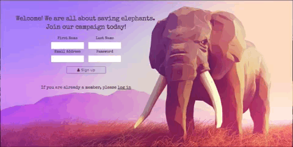
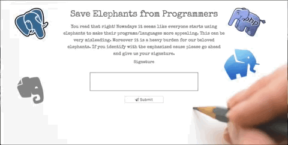
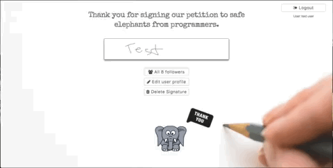
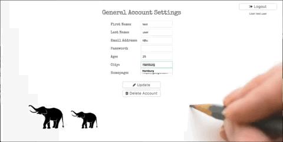

# Petition Project

## Summary
A fun petition that should raise awareness for how many programms and programming languages use elephants nowadays. More important a full stack application as described in the following paragraphs.
## Tech Stack
* Express.js on Node.js
* Express Handlebars Templating
* Redis
* PostgreSQL Database

## Features

* User registration and user sign-in.

* Users have the option to provide some information about themselves.

* Users can sign using their mouse pad on the canvas provided.

* Users can see all signers of the petition and can filter the signers by city.

* Users can update information on their profile.

* Users can delete their signature and resign from the petition. However, they will no longer be able to see the list of signers.
* Users can delete their account entirely.
* Logout.
